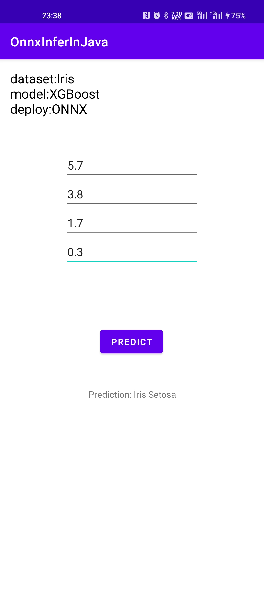

# README

**This project is under Apache 2.0 License.**

## App Inference Demo



## Train

Directory: `xgboost_train`.

### Without bazel

Just run `train.ipynb`.

### Using bazel

1. Install `bazelisk`.

You can install `bazelisk` in multiple ways, including:

- `npm install -g @bazel/bazelisk`
- using [a binary release](https://github.com/bazelbuild/bazelisk/releases) for Linux, macOS, or Windows
- using Homebrew on macOS
- by compiling from source using Go: `go get github.com/bazelbuild/bazelisk

2. Run XGBoostClassifier with Iris dataset:

```bash
cd ./xgboost_train
bazelisk run :train
```

The output model is under `xgboost_train/bazel-xgboost_train`.

3. Convert (.onnx to .ort) (optional)

If you need to use `.ort` model, you can convert with:

```bash
python -m onnxruntime.tools.convert_onnx_models_to_ort <onnx model file or dir>
```

But for xgboost model, `.ort` model is 2~3 times larger than original `.onnx` model.

## Inference (on Android)

Directory: `onnx_inference`.

Install Android Studio and run the APK.

# Q&A

## Why do not deploy with XGBoost4j?

The Android architecture is not official supported in XGBoost4j.

## Why do not convert onnx to TensorFlow and deploy with TFLite?

Because it's impossible as TensorFlow do not implement the XGBoost backend. If you convert onnx to tf model, you would get this convertion error:

Convert code:

```python
import onnx
from onnx_tf.backend import prepare

# Load the ONNX model
onnx_model = onnx.load("xgbc_iris.onnx")

# Convert the ONNX model to TensorFlow format
tf_model = prepare(onnx_model)

# Save the TensorFlow model
tf_model.export_graph("xgbc_iris.tf")
```

Convert result (ERROR):

```plain
Error: "BackendIsNotSupposedToImplementIt: TreeEnsembleClassifier is not implemented."
```
